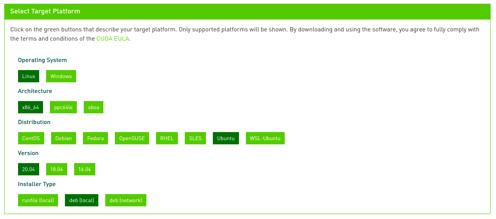
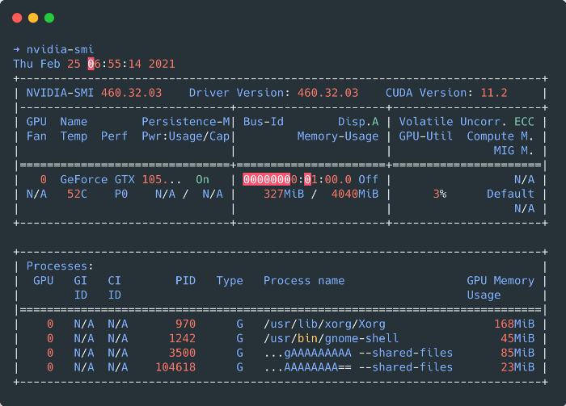
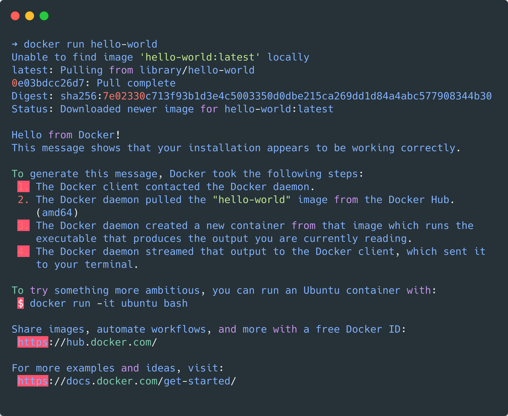

# TLT Setup

Assuming you are running Ubuntu 20.04 LTS, you will need CUDA 11.2, nvidia-docker and a few other dependencies.

## 1. CUDA 11.2

Begin with downloading the deb file from the CUDA repository based on your platform.



Once you have selected your platform appropriately, you will be provided installation commands. If your platform is similar to that of mine, you can install it as follows —

```sh
wget https://developer.download.nvidia.com/compute/cuda/repos/ubuntu2004/x86_64/cuda-ubuntu2004.pin

sudo mv cuda-ubuntu2004.pin /etc/apt/preferences.d/cuda-repository-pin-600

wget https://developer.download.nvidia.com/compute/cuda/11.2.1/local_installers/cuda-repo-ubuntu2004-11-2-local_11.2.1-460.32.03-1_amd64.deb

sudo dpkg -i cuda-repo-ubuntu2004-11-2-local_11.2.1-460.32.03-1_amd64.deb

sudo apt-key add /var/cuda-repo-ubuntu2004-11-2-local/7fa2af80.pub

sudo apt update && sudo apt -y install cuda

sudo reboot
```

If done right, you should have the following output when you run `nvidia-smi`



## 2. Docker

Docker is a platform that helps in the containerization of apps by providing OS-level virtualization.

First, uninstall any older versions you may have lingering on your device —

```sh
sudo apt-get remove docker docker-engine docker.io containerd runc
```

Get dependencies that will allow you to use the `apt` repository

```sh
sudo apt-get update

sudo apt-get install \
  apt-transport-https \
  ca-certificates \
  curl \
  gnupg
```

Add docker’s official GPG key

```sh
curl -fsSL https://downloads.docker.com/linux/ubuntu/gpg | sudo gpg — dearmor -o /usr/share/keyrings/docker-archive-keyring.gpg
```

Add the repository to `apt`

```sh
echo \
  "deb [arch=amd64 signed-by=/usr/share/keyrings/docker-archive-keyring.gpg] https://download.docker.com/linux/ubuntu \
  $(lsb_release -cs) stable" | sudo tee /etc/apt/sources.list.d/docker.list > /dev/null
```

Now, install the docker-engine

```sh
sudo apt-get update && sudo apt-get install docker-ce docker-ce-cli containerd.io
```

Verify by running the hello-world container

```sh
sudo docker run hello-world
```

If done correctly, you should see an output like so —



Psst! Let’s remove the need for using `sudo` with docker commands

```sh
sudo groupadd docker
sudo usermod -aG docker $USER
newgrp docker
```

With this, you will no longer find the need for super-user control when using docker!

## 3. nvidia-docker2

nvidia-docker2 helps to bridge the GPU to docker containers.

Set your distribution

```sh
# If your distribution is <=Ubunu20.04
distribution=$(. /etc/os-release;echo $ID$VERSION_ID)

# If your distribution is >=Ubuntu21.04, hardcode 20.04
distribution=ubuntu20.04
```

Add repository to `apt`

```sh
curl -s -L https://nvidia.github.io/nvidia-container-runtime/experimental/$distribution/nvidia-container-runtime.list | sudo tee /etc/apt/sources.list.d/nvidia-container-runtime.list
```

Install nvidia-docker2

```sh
sudo apt-get update && sudo apt-get install -y nvidia-docker2

sudo systemctl restart docker
```

Test your installation -

```sh
sudo docker run --rm --gpus all nvidia/cuda:11.0-base nvidia-smi
```

## 4. TLT Python packages

These python packages help in pulling containers and mounting targets.

```sh
sudo apt install python3-dev python3-pip
pip3 install nvidia-pyindex
pip3 install nvidia-tlt
pip3 install jupyter
```

## 5. NVIDIA container registry login

This step is vital to access containers from NVIDIA. Sign up at [https://ngc.nvidia.com/signin](https://ngc.nvidia.com/signin) and generate an API Key to login.

```sh
docker login nvcr.io
```

Enter your username as `$oauthtoken` and for password use your NGC API Key.

This marks the end of setting up dependencies. Now you should be all set to get your hands dirty and train models!
